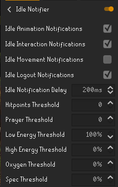
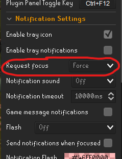

# Willows Dad Woodcutter
<i>A Simple Woodcutting Script for Account building</i>
## Features
- Powerchopping
- Afk-Method
  - When woodcutting this switches screens for you, as if you were "afk" training.
- Dragon-Axe Special
- Randomized breaks
  - Increased chance of break over playtime
- Banking
  - Supports banking that does not require pathing (Draynor, WC Guild, Seers Village)

## Code Integration

- Add the .py file to "OSRS-Bot-COLOR\src\model\osrs"
- In the init file add "from .WDWoodcutting import OSRSWDWoodcutting"

## Setup
- Mark Trees Pink
- Mark Banks Yellow
- Equip or have axe in inventory
- Make bank settings to "Deposit All"
- For afk:
  - Enable idle timer (lower is better, between 300-600ms usually works)
  - In client settings enable notifications to force window focus (this allows the idle timer to automatically switch to runelight)
  - Current uses PyAutgui to send "alt + tab" if this doesnt work for you can change the bindings.

### Plugin Settings for Idle timer
 

### To-Do
- Fix adjust_camera() method to work with threading correctly
- Add functions in setup to insure location, axe and other setup 
