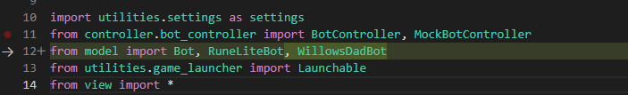
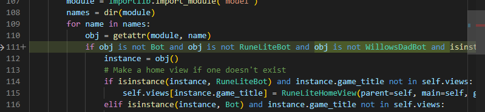

# WillowsDad Bot Class (*BETA*)

|                                 |                           |                               |
|---------------------------------|---------------------------|-------------------------------|
| [Overview](#overview)           | [Features](#features)     |                               |
| [Setup](#setup)                 | [Break System](#break-system) | [AFK-Feature](#afk-feature) |
| [Runelite Properites Profile](#runelite-properites-profile) | [Bots](#bots) | [To-Do](#to-do) |
| [Ultra-Compost](#ultra-compost) | [Degriming](#degriming) |


## Overview
This is a **Beta** bot class that serves as a foundation for me as I build future bots. `WillowsDad_bot` is the parent class for all future bots, and houses the common variables and methods. The current bots include woodcutting, ultra-compost, and degriming, and ***are not without bugs***.  

This also allows me to easily implement my *work-in-progress* break system and afk feature, and other methods.

Setup is easier also, now you just move the whole folder into the `OSRS-Bot-COLOR\src\model\osrs` directory and change only a couple lines of code for the setup. Each bot inherits the RuneLite profile settings from `WillowsDad_bot`.

## Setup
- Add the `WillowsDad` folder to `OSRS-Bot-COLOR\src\model\osrs`
- In the `OSRS-Bot-COLOR\src\model\osrs\__init__.py` file, copy and paste the code block.

```python
from .WillowsDad.WDWoodcutting import OSRSWDWoodcutting
from .WillowsDad.WDUltraCompost import OSRSWDUltraCompostMaker
from .WillowsDad.WDDegrimer import OSRSWDDegrimer
from .WillowsDad.WillowsDad_bot import WillowsDadBot
```
- Make the follow ***2*** changes to `\OSRS-Bot-COLOR\src\OSBC.py`
 
- Now all the bots should show up next time you load OSBC!
- All the needed PNGs are included in the folder already.


### Runelite Properites Profile
- Each bot can launch RuneLite; I recommend this the first time to get the settings profile set up correctly (uses idle timer for AFK methods).
- If you don't want to launch RuneScape from the bot, just import the properties file from the `WillowsDad` folder `"WillowsDad.properties"` into RuneLite via RuneLite profiles GUI. This only needs to happen once.

## Bots
Current and future bots now inherit my first iteration of a **break system** and **AFK feature** where appropriate.  
They all also inherit my basic functions. Like open bank, deposit items, withdraw items etc...  
Banks should always be tagged yellow unless you change the code

### WillowsDad Woodcutting
This is a simple Woodcutting bot that can either power chop, or bank if bank requires no pathing (both trees and bank are in view).
#### Features and Setup
- Banks should be tagged yellow
- Trees should be tagge pink
- Bank deposit settings should be set to "All"
- Can use dragon axe special
- Only tested banking areas are
  - Draynor Oak and Willow
  - Seers Village Maple
  - Woodcutting Guild Yews and Magic

### Ultra-Compost
This is a *basic* Ultra-Compost script. I have made 25m from it so far.
#### Features and Setup
- Banks should be tagged yellow.
- Bank deposit settings should be set to "All"
- Expects all the ashes to be in inventory already.
- Quits on timer or when no more materials.
- ***Afk feature*** doesn't always switch screens do to animation issues. Do not recommend using afk with this script, feel free to test it and change.
- Recommend moving ingredients to a new tab.

### Degriming
This is a simple degriming script for training beginner herblore levels.
#### Features and Setup
- Supports all the herbs
- Bank deposit settings should be set to "All"
- Non-afk/click-intensive mode does a snake motion from top to bottom.
- Afk mode just clicks degrime once and waits for it to be done.
- Quits on time or lack of materials.
- Recommend having herbs in their own tab.

## Features

### Break System
This is the beginning of a break system I am implementing. Chance of taking a break goes up each minute, and the longer the bot runtime, the longer the breaks have a chance of being. 

There are 2 kinds of breaks
- Built in break
  - Here the bot just sits for a random amount of time
- "Menu" break
  - The bot will either inspect equipment tab, or skills tab for a couple seconds.

Will include more and far down the line have more "pro" break systems, maybe if I sell scripts?

### AFK-Feature
Some scripts do things that are "afk-able". This feature simulates that by starting the task, and then sending the keys "alt +tab" to switch screens until focus is pulled back to runelite via runelite idle settings.
- If you are on mac change the keys sent.
- Known issues with the Ultra-Compost bot with this setting.

### To-Do

- Fix `adjust_camera()` method to work with threading correctly.
- Remove afk-feature from parent class since all future bots can't do this (like future combat bot).
- Create variables for image file paths, and image locations on screen.
- Add checks in the setup methods for each bot to check bank settings.
  

